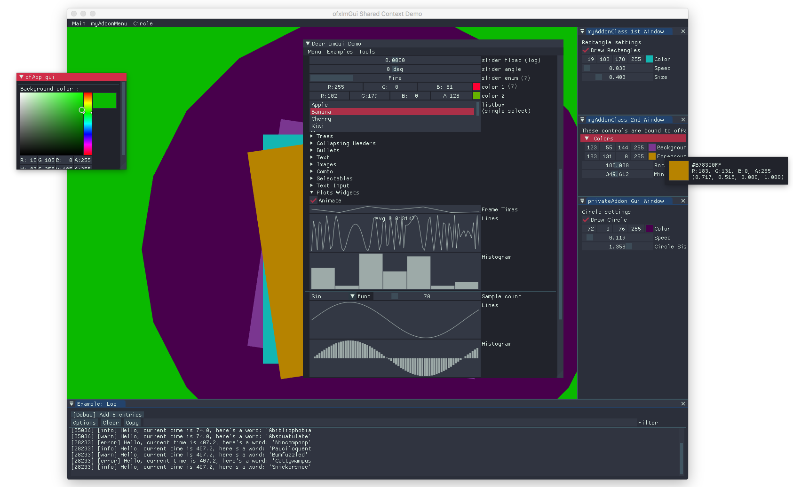

# ofxImGui

ofxAddon that allows you to use [ImGui](https://github.com/ocornut/imgui) in [openFrameworks](https://github.com/openframeworks/openFrameworks).

### Compatibility
Master branch may not be tested on all platforms. See [Releases](https://github.com/jvcleave/ofxImGui/releases/) for more extensively tested versions.

#### Test Platforms
ofxImGui should run on the [latest openFrameworks release and it's OS/IDE requirements](https://openframeworks.cc/download/). These are typically:

 - Mac OSX, Xcode
 - Windows 10, Visual Studio
 - Raspberry Pi
 - Linux Desktop (Ubuntu)

### Examples

#### example-demo    
imgui demo windows with some OF sepcific image loading

#### example-helpers
ofxImGui helper functions for interfacing with `ofParameter`.

#### example-ios  
iOS specific with keyboard input helper.
