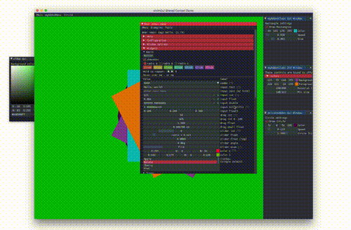

# ofxImGui

ofxAddon that allows you to use [ImGui](https://github.com/ocornut/imgui) in [openFrameworks](https://github.com/openframeworks/openFrameworks).

Unlike most C++ gui libraries, ImGui uses the [immediate mode](https://en.wikipedia.org/wiki/Immediate_mode_(computer_graphics)) paradigm rather then being OOP. In other words, every frame you rebuild the whole GUI, executing only the necessary parts, and ImGui is surprisingly fast at that ! This makes the Gui closer to the OpenGL api as to the inner oF logic (`update()`, `draw()`, `begin()`, `end()`, `push()`, `pop()`, etc.).



- - - -

### Branches
| Branch   | Description |
| ---------|-------------|
| master   | Up-to-date with the latest oF, quite stable. |
| develop  | Active development branch before releasing to the master |
| legacy   | Depreciated. Used for compatibility with the original oF bindings. Can be used to have an updated (but limited) DearImGui in legacy ofxImGui projects. Can be used in non-GLFW rpi setups. |
| OF**     | Master equivalent, blocked at the most update compatible with oF 0.**. |

The master branch may not be tested on all platforms. See [Releases](https://github.com/daandelange/ofxImGui/releases/) for more extensively tested versions.

- - - -

### Supported Platforms
ofxImGui should run on the [latest openFrameworks release and it's OS/IDE requirements](https://openframeworks.cc/download/). These are typically:

 - Mac OSX, Xcode
 - Windows 10, Visual Studio
 - Raspberry Pi
 - Linux Desktop

 Please note that using **ofxImGui in multiwindow OpenFrameworks applications is in testing phase**. For now, one ImGui instance is created per oF window, without any communication in between them (cross-docking won't work). Hopefully DearImGui will introduce something to handle «[multiple host viewports](https://github.com/ocornut/imgui/issues/3012)».

 Currently, **ofxImGui only works on GLFW-based openFrameworks applications**, this seems to become the new oF standard. Thus, the `RPI_LEGACY`, iOS and Vulkan implementations might be broken; as they've not yet been ported to the new ImGui backends. For non-GLFW windows, please use ofxImGui version `< 1.80`.

*Notes on Rpi support: Some combinations of Rpi and oF versions won't provide all GLSL versions. It's recommended to use the full KMS driver rather then the Legacy Broadcom one (very low FPS), but they both work. Tested with Raspbian Stretch. Also, if you start your application with a minimal desktop environment (using `startx ./bin/ofApp`), the imgui viewport features do not work correctly.* 

#### GLSL Support Table

| OS | OpenGL 2.x | OpenGL 3.x  | OpenGL 4.x | GL ES 1.0 | GL ES 2 | GL ES 3 |
|---|---|---|---|---|---|---|
| Windows | Yes | Yes | Yes | Unknown | Unknown | Unknown |
| Mac OsX | Yes | Yes | Yes |  *Unavailable* | *Unavailable* | *Unavailable* |
| Linux | Yes | Yes | Yes | Yes | Yes |
| Rpi3 | Should | Unknown | Unknown | Yes | Yes | Yes |
| Rpi4 | Unknown | Should | Should | Should | Should | Should |
| iOS | *Unavailable* | *Unavailable* | *Unavailable* | Should | Should | Should |

*Note: This support table does not take into account software emulated support for graphics APIs.*  
*Note: GL ES 1 (the fixed pipeline ES shading language) is not natively supported by the native DearImGui backend, but it works with [some dirty hacks](src/gles1CompatibilityHacks.h).*

Older versions of ofxImGui, which come with an older DearImGui version, use a simpler backend very close to OF, probably compatible with any OF version at that time. Try the latest [ofxImGui legacy version 1.77](https://github.com/jvcleave/ofxImGui/tree/legacy), or try [this untested transition commit](https://github.com/jvcleave/ofxImGui/tree/05ab1311511523c63c6f22d38ee015942b9ea557) together with `OFXIMGUI_ENABLE_OF_BINDINGS` if you need ImGui 1.79 features.

#### oF & ImGui Support Table
New ImGui versions bring changes and new API features, sometimes depreciations. 

| ofxImGui version  | ImGui version | Supported oF version |
|------------------:|---------------|----------------------|
| ofxImGui 1.82     | 1.82*         | 0.11 -> 0.11.2 |
| ofxImGui 1.79     | 1.79*         | 0.11.1 |
| ofxImGui 1.75     | 1.75          | 0.11.x |
| ofxImGui 1.62     | 1.62          | 0.10.x | 
| ofxImGui 1.50     | 1.50 WIP      | 0.10.x |
| ofxImGui 1.49     | 1.49          | 0.10.x |
| ofxImGui 1.47     | 1.47          | 0.10.x |
| ofxImGui 0.90     | 1.45 WIP      | 0.9.x  |

__*__ Uses the native ImGui backend, offering pop-out-windows (viewports), docking, gamepad control, and more.

- - - -

## Usage

### Install
````bash
cd /path/to/of/addons && git clone https://github.com/Daandelange/ofxImGui.git
````

### Optional
Configure oF (tested with 0.11.0) to use GLFW 3.4 and imgui will have an even more polished interface. See [Developpers.md](./Developpers.md#Improve-ofxImGui-s-backend-bindings).  
This step is also recommended for RPIs where GLFW is v3.2, which doesn't provide gamepad support.  

### Compilation flags
DearImGui needs to know your GL Context. ofxImGui tries to match your project's settings. If your projects needs to force a specific GL configuration, you can set some native imgui compilation flags to match your project settings :
 - `IMGUI_IMPL_OPENGL_ES2` --> Use GLES2 (or GL ES 1.1 with some hacks).
 - `IMGUI_IMPL_OPENGL_ES3` --> Use GLES3.
 - `[none of the previous ones]` --> Use OpenGL.

### Setup
Calling `mygui.setup()`, you can pass a few arguments to setup ofxImGui to your needs.  
ofxImGui implements DearImGui in such a way that each oF window gets its own imgui context, seamlessly shared between any oF window context. You can also load multiple instances of it in the same ofApp (use the addon within multiple addons). This feature (shared context) is automatically enabled when a second `ofxImGui::Gui` instance is created within the same application's platform window context. See example-sharedContext for more tweaks.  
_Note: Only the fist call to `gui.setup()` has full control over the settings (master); the next ones setup as slaves._  
_Note: Any call to `setup()` has to be done from a valid ofWindow, `ofGetWindowPtr()` is used internally._  
- **theme** : `nullptr` (use default theme, default), `BaseTheme*` (pointer to you theme instance))
- **autoDraw** : `true` (automatic, sets up a listener on `ofApp::afterDraw()`, default) / `false` (manual, allows more precise control over the oF rendering pipeline, you have to call `myGui.draw()` )
- **customFlags** : `ImGuiConfigFlags` ( set custom ImGui config flags, default: `ImGuiConfigFlags_None`)
- **restoreGuiState** : `true` (enabled) or `false` (disabled, default).  
Helper for enabling ImGui's layout saving/restoring feature. Creates `imgui.ini` next to your app binary to save some GUI parameters.
- **showImGuiMouseCursor** : `true` (use the imgui mouse cursor) or `false` (use default system mouse cursor, default).

You might occasionaly want to enable `OFXIMGUI_DEBUG`, it provides some general warnings on mistakes and logs some important setup steps.

#### Advanced setup : ImGui config flags & ImGui::GetIO().
ofxImGui provides a simple way to interface imgui, but it's a huge library providing lots of different options to suit your precise needs.  
Most of these advanced options are explained in the `imgui_demo.cpp` source code. Also checkout `example-dockingandviewports` and `example-advanced`.

- - - -

## Examples
There are several example projects, covering from the simplest use case to more advanced ones : [Examples.md](./Examples.md).

- - - -

## Developper info
Useful dev info and how to get familiar with DearImGui : [Developper.md](./Developpers.md).

- - - -

## Updating ofxImGui
- `cd /path/to/ofxImGui && git pull && git submodule update`
- (*optional*) After updating: Add `#define IMGUI_DISABLE_OBSOLETE_FUNCTIONS` in your `imconfig.h` file to make sure you are not using to-be-obsoleted symbols. Update any if needed.


